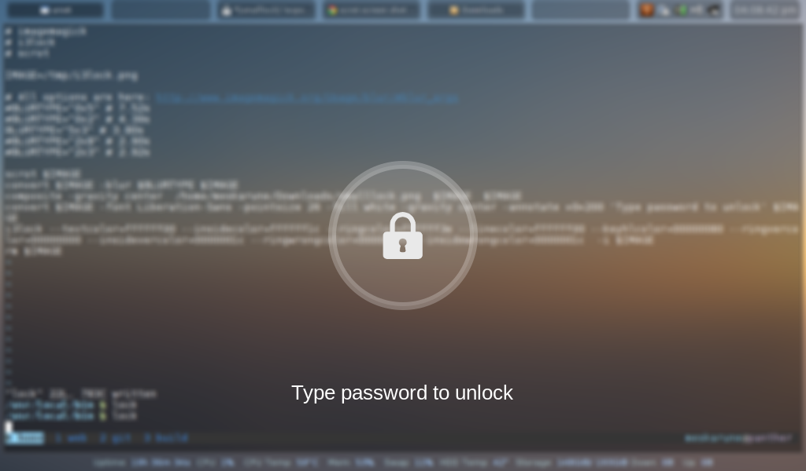

# script-i3lock

Instalacion de i3lock personalizado basado en i3lock-fancy, configurado para el uso de 2 monitores y que se ejecute luego de 8min de espera.

i3lock-fancy: [github](https://github.com/meskarune/i3lock-fancy)



## Instalacion

1. Ejecutar los siguientes comandos:

```bash
git clone https://github.com/avillalba96/script-i3lock.git && cd "$(basename "$_" .git)"
sudo apt install xautolock -y
sudo make install
```

## Configurar "Shortcut"

1. Se dejara un script en python para facilitarlo en caso de usar consola:

```bash
#!/usr/bin/env python3

import subprocess
import sys

# defining keys & strings to be used
key = "org.gnome.settings-daemon.plugins.media-keys custom-keybindings"
subkey1 = key.replace(" ", ".")[:-1]+":"
item_s = "/"+key.replace(" ", "/").replace(".", "/")+"/"
firstname = "custom"
# get the current list of custom shortcuts
get = lambda cmd: subprocess.check_output(["/bin/bash", "-c", cmd]).decode("utf-8")
array_str = get("gsettings get "+key)
# in case the array was empty, remove the annotation hints
command_result = array_str.lstrip("@as")
current = eval(command_result)
# make sure the additional keybinding mention is no duplicate
n = 1
while True:
    new = item_s+firstname+str(n)+"/"
    if new in current:
        n = n+1
    else:
        break
# add the new keybinding to the list
current.append(new)
# create the shortcut, set the name, command and shortcut key
cmd0 = 'gsettings set '+key+' "'+str(current)+'"'
cmd1 = 'gsettings set '+subkey1+new+" name '"+sys.argv[1]+"'"
cmd2 = 'gsettings set '+subkey1+new+" command '"+sys.argv[2]+"'"
cmd3 = 'gsettings set '+subkey1+new+" binding '"+sys.argv[3]+"'"

for cmd in [cmd0, cmd1, cmd2, cmd3]:
    subprocess.call(["/bin/bash", "-c", cmd])
```

* Comando de ejemplo:

```python
python3 set_customshortcut.py "Name" "Command" "<Primary><Alt>e"
python3 set_customshortcut.py "i3lock-fancy" "i3lock-fancy" "<Primary><Alt>e"
```

* Lista de teclas para usar:

```bash
Super key:                 <Super>
Control key:               <Primary> or <Control>
Alt key:                   <Alt>
Shift key:                 <Shift>
numbers:                   1 (just the number)
Spacebar:                  space
Slash key:                 slash
Asterisk key:              asterisk (so it would need `<Shift>` as well)
Ampersand key:             ampersand (so it would need <Shift> as well)

a few numpad keys:
Numpad divide key (`/`):   KP_Divide
Numpad multiply (Asterisk):KP_Multiply
Numpad number key(s):      KP_1
Numpad `-`:                KP_Subtract
```
